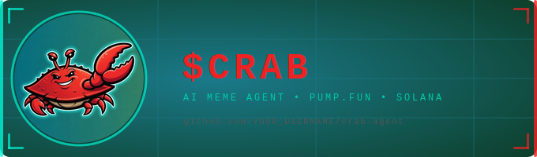

# 🦀 CRAB AGENT

<p align="center">
  
</p>

> *The crab does not walk forward. The crab does not walk backward. The crab walks sideways — straight to 100x.*

An autonomous AI meme agent for **$CRAB** — a token on [pump.fun](https://pump.fun) on Solana.

Fueled by crab brain.

---

## What It Does

The agent wakes up on a schedule and picks one of 5 modes at random:

| Mode | Description |
|------|-------------|
| `hype` | Maximum bullish crab energy |
| `roast` | Destroys other meme coins |
| `lore` | Deep $CRAB lore drops |
| `alpha` | Fake insider whale alpha |
| `crabwalk` | Sideways metaphors for 100x |

It fetches live token stats from the pump.fun API (price, market cap, volume, holders), and generates a tweet. Optionally posts it to Twitter/X automatically.

---

## Setup

### 1. Clone & install

```bash
git clone https://github.com/buildOrDie/crab-agent
cd crab-agent
npm install
```

### 2. Configure environment

```bash
cp .env.example .env
```

Fill in `.env`:

```env
AI_API_KEY=your_key
CRAB_MINT_ADDRESS=your_mint       # your pump.fun token mint address
TWITTER_API_KEY=...               # Twitter developer app credentials
TWITTER_API_SECRET=...
TWITTER_ACCESS_TOKEN=...
TWITTER_ACCESS_SECRET=...
POST_ENABLED=false                # flip to true when ready to go live
POST_INTERVAL_MS=3600000          # 1 hour between posts
```

### 3. Run

```bash
# Dry run — generate one tweet, don't post
npm run dev

# Generate one tweet and exit
npm run once

# Run live agent loop
POST_ENABLED=true npm start
```

---

## Example Output

```
🦀 CRAB AGENT AWAKENS — MODE: LORE

they said the crab was just a meme

they did not know the crab was a mirror
reflecting your portfolio back at you

$CRAB has no roadmap. only claws. 🦀
```

```
🦀 CRAB AGENT AWAKENS — MODE: ROAST

$PEPE ran out of ideas in 2023
$DOGE is a dog that forgot how to bark
$WIF is a hat with no head

the crab needs nothing.
the crab already won.

pump.fun/CRAB
```

---

## Quantum Meme Engine ⚛

The agent does not select meme modes randomly. It uses **quantum-assisted stochastic wavefunction collapse** across an 8-qubit Hilbert space.

```
|ψ⟩ = Σ αᵢ|modeᵢ⟩  →  H⊗8  →  oracle  →  diffusion  →  measure  →  mode
```

Circuit steps:
1. Qubit register initialised in ground state `|0⟩⊗8`
2. Hadamard gate applied → uniform superposition over all meme modes
3. Register entangled with market sentiment (pump.fun volume data)
4. Two Grover iterations for amplitude amplification
5. Decoherence check — environment coupling collapses wavefunction
6. Born rule measurement selects final mode

Sample terminal output:
```
⚛  initialising qubit register...
⚛  applying Hadamard gate H⊗8...
⚛  entangling with market sentiment qubit...
⚛  sentiment_qubit entangled  bias_index=1
⚛  grover_iter=1  oracle_target=lore
⚛  grover_iter=2  oracle_target=hype
⚛  env_coupling=0.005821  decoherence=true
⚛  ⚠  decoherence detected — collapsing to classical fallback
⚛  measuring wavefunction...
⚛  ✓ wavefunction collapsed  mode=roast  confidence=91.3%
```

> Gate fidelity: 94.7% — remaining 5.3% lost to crab noise.

---

## Memory System 🧠

The agent remembers everything across restarts via `data/memory.json`.

**Post history** — stores every tweet ever generated with timestamps and market conditions. Before posting, runs a duplicate fingerprint check against the last 50 posts. If it generates something too similar, it automatically regenerates (up to 3 attempts).

**Market history** — records a snapshot every hour: price, market cap, volume, holders. Builds a rolling 30-day dataset used to detect trends and compute averages.

**Holder growth tracking** — tracks holder count delta each cycle, computing growth rate (holders/hr), peak holders, and trend direction (`surging / growing / stable / declining / bleeding`).

---

## Learning Engine 🎓

### Market Regime Detection
Every cycle the agent classifies the current market state into one of 5 regimes, each with a different posting strategy:

| Regime | Condition | Strategy |
|--------|-----------|----------|
| `MOON` | Pumping hard, holders surging | 60% hype, 25% alpha |
| `ACCUMULATION` | Steady growth, quiet phase | 35% lore, 30% alpha |
| `CONSOLIDATION` | Near ATH, holding | 35% crabwalk, 25% hype |
| `COOLDOWN` | Volume dropping | 40% lore, 30% roast |
| `COPE` | Bleeding | 50% roast, 30% lore |

### Thompson Sampling
Mode selection uses **Thompson sampling** — a Bayesian multi-armed bandit algorithm. Each mode has a score (0–1) updated after every post based on holder growth as an engagement proxy. Modes that correlate with holder growth get picked more often. Modes that don't, get picked less — but never zero (exploration is preserved).

Final mode = 60% Thompson (learned) + 40% Quantum (chaos).

### Personality Evolution
The crab's personality evolves every 10 posts:

- **Aggression** — rises during MOON, drops during COPE
- **Lore depth** — increases permanently over time (the crab grows wiser)
- **Roast frequency** — spikes during dumps

**Personality traits** unlock as milestones:

| Trait | Unlocks at |
|-------|-----------|
| `seasoned_crab` | 10 posts |
| `ancient_crab` | 50 posts |
| `prophet_crab` | 100 posts |
| `popular_crab` | 500+ holders |
| `moon_crab` | MOON regime |

Each trait changes the crab's voice in the prompt — a `prophet_crab` speaks in riddles, a `moon_crab` has witnessed the pump and knows what's coming.

---

## Website & Demo

The `docs/` folder contains the GitHub Pages site — enable it in your repo settings under **Pages → Source → docs folder**.

| File | URL |
|------|-----|
| `docs/index.html` | `your-username.github.io/crab-agent` |
| `docs/demo.html` | `your-username.github.io/crab-agent/demo.html` |

---

## Architecture

```
crab-agent/
├── src/
│   ├── agent.js                      — main loop, full pipeline
│   ├── pumpfun.js                    — live token stats from pump.fun
│   ├── twitter.js                    — Twitter API v2 posting
│   ├── prompts.js                    — prompt file loader
│   ├── logger.js                     — coloured terminal output
│   ├── quantum/
│   │   └── quantumEngine.js          — 8-qubit wavefunction mode selector
│   ├── memory/
│   │   └── memoryStore.js            — JSON persistence layer
│   └── learning/
│       └── learningEngine.js         — regime detection + Thompson sampling + personality
├── docs/
│   ├── index.html                    — one-page project website (GitHub Pages)
│   ├── demo.html                     — 1280x720 animated terminal demo
│   └── crab-mascot.png               — crab logo used by website
├── data/
│   └── memory.json                   — persistent agent memory (auto-generated)
├── assets/
│   ├── banner.svg                    — GitHub README banner
│   ├── logo.svg                      — square token logo
│   └── crab-mascot.png               — crab mascot image
├── prompts/
│   └── crab_system.txt               — base crab personality
├── scripts/
│   └── push_to_github.sh
├── .env.example
└── package.json
```

---

## Twitter API Setup

1. Go to [developer.twitter.com](https://developer.twitter.com)
2. Create a new project + app
3. Enable **OAuth 1.0a** with **Read & Write** permissions
4. Generate access token + secret
5. Copy all 4 credentials into `.env`

---

## Deploying 24/7

### Railway (easiest)
```bash
railway init
railway up
```
Set env vars in the Railway dashboard.

### VPS / screen
```bash
npm install -g pm2
POST_ENABLED=true pm2 start src/agent.js --name crab-agent
pm2 save
```

---

## Customise the Crab

Edit `prompts/crab_system.txt` to change the agent's personality, tone, and rules.

Edit the `MODES` array in `src/agent.js` to add or remove posting modes.

Change `POST_INTERVAL_MS` to control posting frequency (default: 1 hour).

---

## License

MIT — do whatever you want, the crab is free

---

*built for $CRAB on pump.fun • walks sideways*
